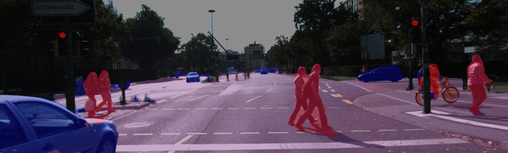

# DilatedResNets
Pytorch implementation of https://www.cs.princeton.edu/~funk/drn.pdf

# Requirements
+ Pytorch
+ Python 3.x
+ Tensorboad-pytorch
+ OpenCV
+ Anaconda packages

# Train [For road segmentation]

(a) Download the "fine" cityscapes dataset: https://www.cityscapes-dataset.com/

(b) Create a folder for the dataset with the following structure and name its folder "cityscapes_fine_light" (or change the defualt settings according to your own name):

    ├──
    ├── images                    
    │   ├── test              # Training sample images
    │   ├── train         
    │   └── val 
    ├── gt                    # Ground truths
    │   ├── test         
    │   ├── train        
    │   └── val    
    └── ...
    

Now just a little bit of pre-processing since you won't need all the stuff you just downloaded. For images/test, images/train, images/val, you'll have a folder for each city (Aachen, Zuerich, etc.). Remove the city folders, so that you eventualy have:

images/test/aachen_000000_000019_leftImg8bit.png 

INSTEAD OF

images/test/aachen/aachen_000000_000019_leftImg8bit.png

Do the same for the ground truths. Also, only keep the _gtFine_labelIds.png files (for each image, there are 4 kinds of ground truth, only keep the label IDs).

(c) After setting the right arguments, run main_train.py 

Note: you can also download pre-trained models, just set --pretrained tag as True. This will download the weights from the Princeton website.

# Inference

(a) Download the weights from my Google Drive: https://drive.google.com/open?id=1bCqtyPlxd-PAmFKvTL8fpxKitQnpFz9H
Then place the log folder in the project folder DilatedResNets. 
I trained this model on the CityScapes fine dataset as reported in the paper: 100 epochs, momentum=0.9, lr=0.01 with lr /= 10 each 30 epochs. Alternatively, you can also download pre-trained models, just set --pretrained tag as True. This will download the weights from the Princeton website.
 
(b) Create a folder that contains the images on which you want to test your model. The default settings will test the model on the test images of the CityScapes dataset contained in the cityscpaes_fine_light folder:

(b) Run main_test.py

